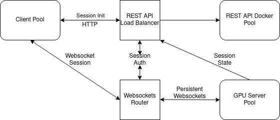

<h1 align=center>PEARL API & Infrastructure</h1>

PEARL is a landcover mapping platform that uses human in the loop machine learning approach. This repository contains the API and infrastructure to run the platform. The frontend is maintained at [pearl-frontend](https://github.com/developmentseed/pearl-frontend/).
## Overview
PEARL infrastructure uses Kubernetes to manage resources and provide on-demand GPU support. The following is a high-level architecture. A websocket router manages available GPU/CPU and allocates them to clients.



## Development

Initial development can be bootstrapped by running all of the services via docker-compose

```sh
docker-compose up --build -d
```

This script will ensure that you have a postgres database set up, and will configure and
start all necessary services locally for a fully functional dev environment

## API Documentation

API documentation can be found by opening the following location in your browser `file://<path-to-git-repo>/lulc-infra/api/doc/index.html`

or ideally, once your development environment has been started, API documentation can be found
by navigating to `http://localhost:2000/docs`.

## Deployment and CI

Notes on deploy process and CI integration can be found [here](docs/deploy.md).

## Debugging and Logs

Instructions for accessing the Grafana UI to inspect application logs can be found [here](docs/logs.md)