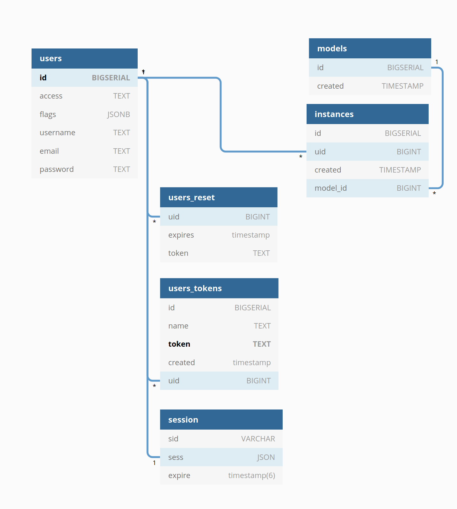

<h1 align=center>LULC API Infrastructure</h1>

<p align=center>API Infrastructure for the LULC project</p>

The API portion of the LULC project handles authentication and stateful data
that exists in the database.

## Development

It is generally recommended to run the bootstrap scripts described in the main project README.

If it is desired to run the API without other parts of the project, run the following

```sh
npm run dev
```

## API Documentation

It is generally recommended to run the bootstrap scripts described in the main project README

If it is deisred to generate documentation direction, use the following command

```sh
npm run doc
```

See the main README for how to view API documentation once generated

## Deployment

### Environment Variables

#### `CookieSecret`

#### `TokenSecret`

#### `InstanceSecret`

#### `Postgres`


## API

All JSON paths can be found in the `./index.js` file in this directory. Each
path must have an [APIDoc](https://apidocjs.com/) section.

Paths that accept user data are also required to have a [json schema](https://json-schema.org/)
to enforce validity. This JSON schema can also be used to help automatically
generate API Docs. JSON schemas can all be found in the `./schema` directory

```js
/**
 * @api {post} /api/login Create Session
 * @apiVersion 1.0.0
 * @apiName login
 * @apiGroup Login
 * @apiPermission user
 *
 * @apiDescription
 *     Log a user into the service and create an authenticated cookie
 *
 * @apiSchema (Body) {jsonschema=./schema/login.json} apiParam
 */
router.post(
    '/login',
    validate({ body: require('./schema/login.json') }),
    async (req, res) => {
        // business login
    }
);
```

## Database


